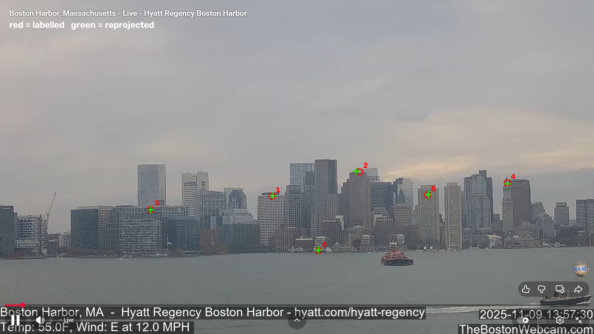

# Camera Calibration from Geo-Referenced Landmarks

Recover a fixed webcam's **intrinsics** (focal length) and **extrinsics** (where it is and which way it points) from nothing but one frame and six landmarks I matched by hand to real-world coordinates.


*Red circles: pixels I labelled. Green crosses: the same landmarks projected back through the solved camera.*

## Result (Boston Harbor webcam, 1920x1080)

| | |
| --- | --- |
| Focal length | 2828 px (37.5 deg horizontal FOV) |
| Camera position | 42.3585, -71.0301, ~23 m (East Boston waterfront) |
| Viewing direction | 259 deg, west toward downtown |
| Fit reprojection error | 5.2 px RMS |
| Leave-one-out error | 15.4 px median |

The gap between fit error and leave-one-out error is the honest part: with six landmarks the model fits them well but predicts an unseen landmark about 3x worse. More, better-spread landmarks are the fix.

## Pipeline

1. **Label correspondences**: pick distinctive points in the image (rooftops, a clock tower, the waterline) and look up each one's latitude, longitude and altitude. Stored in `matches.csv`.
2. **Validate the data**: reject shifted columns, duplicate points, or landmarks far from the camera's real location before solving anything.
3. **Convert to a local metric frame**: lat/lng/alt to East-North-Up metres around the landmarks' centroid.
4. **Solve the camera**: assume square pixels and a centred principal point, sweep focal length, and for each value solve the camera pose with PnP (`cv2.solvePnP`, SQPnP + Levenberg-Marquardt refinement). Keep the focal length with the lowest reprojection error.
5. **Evaluate**: per-point reprojection error, plus leave-one-out error, and a reprojection overlay.

The projection model is the standard pinhole camera, `s [u v 1]^T = K [R | t] [X Y Z 1]^T`, with `K = [[f 0 cx] [0 f cy] [0 0 1]]`.

## Why this matters for robotics

This is the same problem as robot-camera calibration: known 3D points + their 2D pixels -> camera intrinsics and pose. On a robot cell the 3D points come from a calibration board or the robot's own end-effector instead of a map, and the pose feeds hand-eye calibration and pick-and-place coordinate mapping.

## Run it

```bash
pip install -r requirements.txt
python calibrate.py boston_harbor_massachusetts --expect 42.36 -71.05 10
```

`--expect LAT LNG RADIUS_KM` fails fast if the landmarks aren't where the camera is.

### Interactive demo

```bash
streamlit run app.py
```

Opens a browser page with the solved camera's numbers, the reprojection overlay, a map of the landmarks and the solved camera position, and the error-vs-field-of-view curve the solver minimises. Untick landmarks in the sidebar to see how the solution and the held-out error change.

## Known limitations

- Six points is the bare minimum; 12+ spread across the frame would tighten the result.
- Lens distortion is not modelled. A checkerboard calibration (`cv2.calibrateCamera`) would estimate k1, k2, p1, p2.
- Landmark altitudes are approximate, which may explain point 2's larger error.
